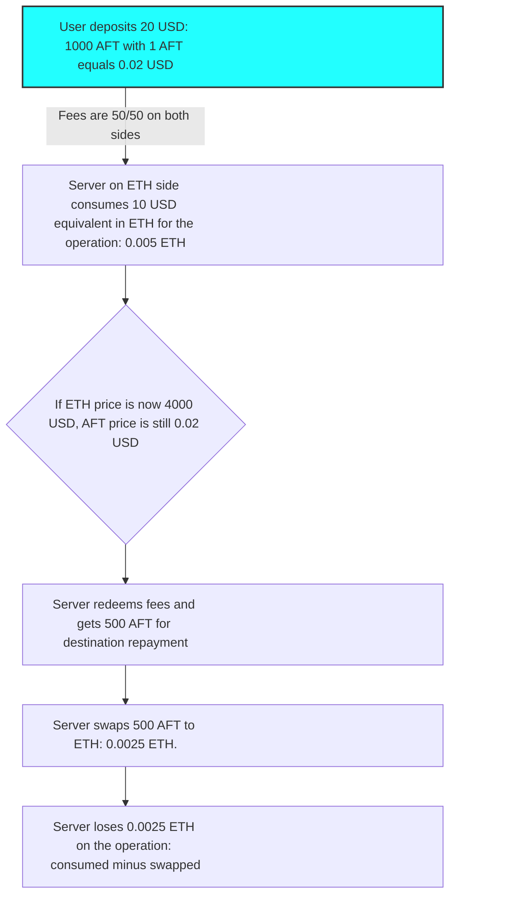
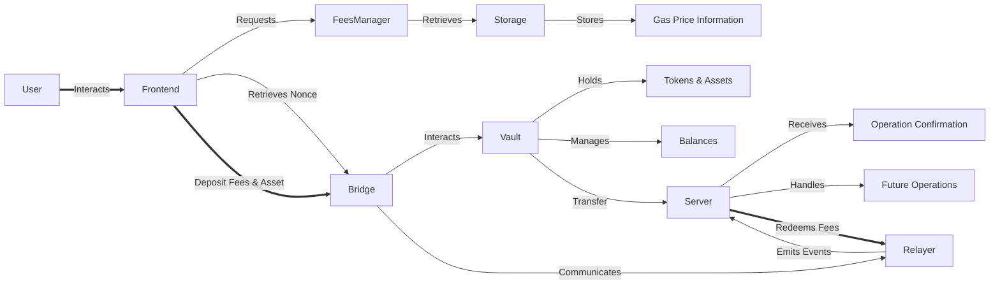
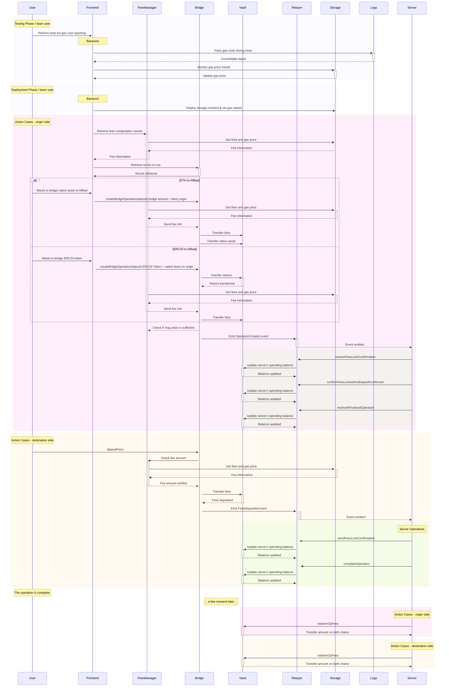
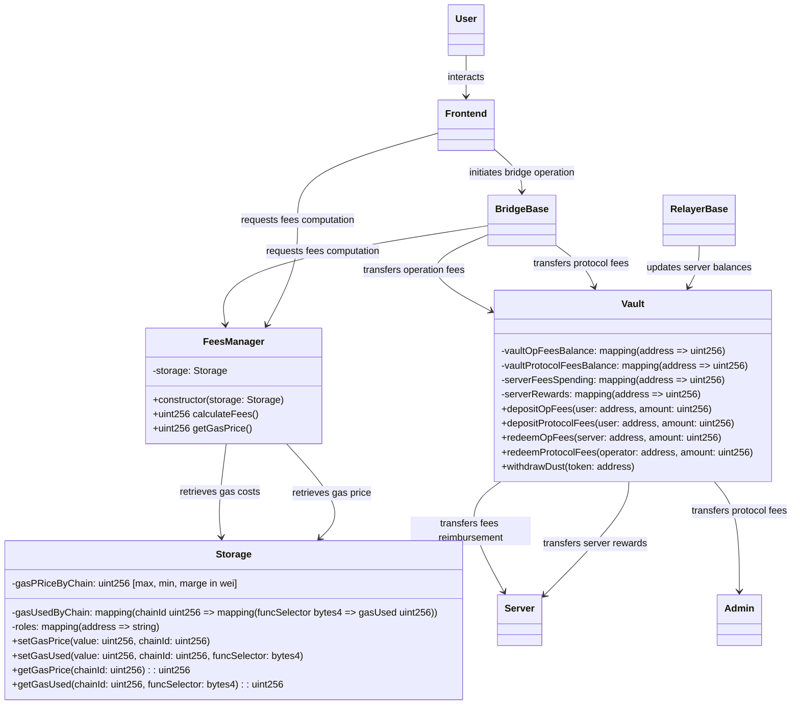

# BRIDGE-MVP: Fees Management

## Table of Contents

1. [Introduction](#introduction)
2. [Types of Fees](#types-of-fees)
3. [Economic Considerations](#economic-considerations)
   - [Estimation of Needs and Potential](#estimation-of-needs-and-potential)
   - [Current Base Used for Fees](#current-base-used-for-fees)
4. [Considerations for Operation Fees](#considerations-for-operation-fees)
5. [Possible Approaches to Fees Management](#possible-approaches-and-actions-needed)
   - [Global Approach](#global-approach)
   - [Actor Actions Needed](#actor-actions-needed)
   - [In Short](#in-short)
6. [Chosen Approach](#selected-solution-and-explanation)
   - [Selected Solution and Explanation](#selected-solution-and-explanation)
   - [Potential Future Enhancements](#potential-future-enhancements)

## Introduction

As we continue to develop our EVM bridge project, it is crucial to address the management of transaction fees. Currently, we have a proof of concept (POC) of the bridge, which includes functional smart contracts and an operational off-chain server. This setup allows us to transfer tokens and native coins between EVM-compatible networks, specifically testing on Polygon, Allfeat, and Sepolia.

Effective fees management is essential for the project's viability. On one hand, numerous transactions are required for server-side operations; if we do not charge users, we risk operating at a loss. On the other hand, we must consider a revenue model to cover ancillary expenses (such as server costs) and ensure that we can generate a minimum profit to maintain the system.

## Types of Fees

Considering the global context of the project, we can identify several types of fees that may be relevant:

- **Transaction Fees:** Fees consumed by operators (users and servers) for each transaction processed by the bridge. We will call these fees "operation fees" (opFees) in this document.
- **Infrastructure Fees:** Costs related to maintaining the bridge's infrastructure, such as server hosting, maintenance, and development. These fees are essential for the bridge's operation and sustainability. We will call these fees "protocol fees" (protocolFees) in this document.

## Economic Considerations

### Estimation of Needs and Potential

- Music industry market size & growth (40 billion projection)
- Hypothesis of 1% capture (?)
- Study of bridges volumes / their ecosystem
- Evaluate the potential of the bridge in terms of volume and fees in different scenarios (low, medium, high)
- Give estimation of infrastructure costs and other costs (legal, marketing, etc).
- Calculate minimum volume needed to break even based on different fees scenarios.

### Current Base Used for Fees

Based on observation of other bridges, we can estimate the fees that could be charged to users. We decided to charge a fee of 0.5% on each operation, which is in line with the industry standard. In addition, we will have a limit of the minimum amount transferred to have a minimum fee for each operation, which we set at 100 equivalent USD.

These choices can vary depending on the evolution of research and the project. For example, it is studied to have a dynamic fee based on the volume of the bridge and a different base fee (from 0.3% to 1% or 1.5%) for the different types of assets (stablecoin, big market cap, more risky/volatile assets).

Main assets targeted for the bridge are native coins and stablecoins, to address ecosystems interoperability and to provide a way to transfer stable value between different blockchains in order to facilitate potential real-world use cases and payments.

In order to gain traction and volume, we will have to provide competitive fees and a good user experience. We will have to adapt our fees and services to the market and the competition. We could also think of a way to reward users and provide incentives to use the bridge.

### Ambitions and Objectives

As a small team on a new blockchain, we keep small objectives and focus on the main assets and the main use cases. Knowing that if the blockchain grows, other bigger actors well-structured will be able to provide more complex services and assets. We are there to make the first step, make things possible and participate in the growth of the ecosystem.

## Considerations for Operation Fees

- For one operation:

  - A user will have to call: `createBridgeOperation` and `depositFees` on the bridge contract.
  - The server will have to call:
    - `receiveFeesLockConfirmation` on the origin bridge contract
    - `confirmFeesLockedAndDepositConfirmed` on the origin bridge contract
    - `receivedFinalizedOperation` on the origin bridge contract
    - `sendFeesLockConfirmation` on the receiver bridge contract
    - `completeOperation` on the receiver bridge contract
    - `emitCancelOperation` on the receiver bridge contract (alternative case)

- User transactions are charged directly as they sign the transaction and pay the fees.

- Server transactions will be paid by the server, but the fees will be taken from the fees deposited by the user.

- OpFees should thus be calculated based on the gas used by the server for each operation in order to cover the costs of the server. The base used for calculation should consider average and worst-case scenarios.

- Considering the worst-case scenario as base price. If the server optimizes its call when batching is possible, it can incentivize the server to optimize its calls and gain a little more profit.

## Possible Approaches and Actions Needed

### Global approach

There are several approaches we can take regarding fees management:

- **Full Coverage:** Absorbing all transaction fees.
- **Partial Coverage:** Only covering a portion of the fees.
- **Selective Charging:** Charging fees either at the origin or destination of the transaction, or both.

The first two options are not viable or need to find funding to cover the fees. The third option is the most viable and secure way to implement the fees management.

### Actor actions needed

- Observation and simulation are done to estimate the gas used by the server for each transaction, and a report of gas price and gas used is provided feeding the storage contract.

- User (few choices possible):

  - Case 1: _deposit fees on destination only_
    - is charged for protocol fees on origin
    - pay opFees on origin for the first tx
    - deposit opFees complement on destination
  - Case 2: _take fees on both sides_
    - is charged for protocol fees on origin
    - pay opFees on origin for all server transactions on this side
    - pay opFees on destination for the transaction on this side
  - Case 3: _take all fees as % of the bridged token on origin deposit (stablecoin for example)_
    - is charged for protocol fees on origin
    - pay all fees on origin in stablecoin (need to re balance the fees between chains to track and feed fees vault at destination of the server and to convert the fees in the right asset to not lose value)
  - Case 4: _pre subscription on both side_
    - user funds a subscription account with fees and the fees are taken from this account, decreasing the number of transactions and the fees paid by the user.

- Server:

  - Consider he made an advance payment of fees to the bridge and is refunded by the user fees deposited on the bridge.
  - For each call to the contract, the balance fees of the server is updated according to the fee data registered in the storage contract.
  - Its balance is updated at the end of each operation and the fees are taken from the fees deposited by the user.
  - He can redeem his fees at any time.
  - The same process is done for the protocol fees.

  - In the first version of the bridge, only one server is used and so only one will redeem fees. In the next version, a rotation will be done to choose the execution server. The update of the server balance could be optimized according to the chosen solution.

- Admin:
  - He can redeem the protocol fees at any time to an admin address.
  - He can update the fees and protocol fees values in the storage contract.
  - One other special role should be dedicated for such actions (as for pausing and unpausing the bridge...).

### In Short:

It appears that the chosen method depends on the user perspective; all other actions can be fitted to the user perspective. We can thus give pros and cons for each user perspective.

| Option                             | Advantages                                               | Disadvantages                                                                                            |
| ---------------------------------- | -------------------------------------------------------- | -------------------------------------------------------------------------------------------------------- |
| 1. Deposit fees on the destination | Simplicity for the user                                  | Risk of loss at the source (having fees denominated in destination currency if origin is more expensive) |
| 2. Take fees on both sides         | Better cost control, more robust and easier to implement | Increased complexity for the user (more actions needed)                                                  |
| 3. Bridging only stablecoins       | Optimized user experience                                | Dependence on oracles and AMMs (currently none implemented on Allfeat)                                   |
| 4. Subscription system             | Flexibility for users                                    | Difficulty managing gas fluctuations                                                                     |
| 5. Dynamic pricing model           | Real-time adjustment of fees                             | May be perceived as unpredictable                                                                        |
| 6. Use of specific fee tokens      | Standardization of fees                                  | Additional complexity in management                                                                      |

**Illustration of risk case 1:**

- User deposits 20 USD equivalent in AFT corresponding to 1000 AFT (1 AFT = 0.02 USD) when ETH is at 2000 USD.
- Server on ETH side consumed 10 USD equivalent in ETH for the operation: 0.005 ETH.
- If ETH price is now 4000 USD and AFT is still 0.02 USD, when the server redeems his fees he will get: 500 AFT for destination repayment and 500 AFT to swap to ETH to reimburse its calls on origin, he will get 500 AFT \* 0.02 USD = 10 USD, and 10 USD / 4000 USD = 0.0025 ETH. He will lose 0.0025 ETH on the operation.
- After 1000 operations he will lose 2.5 ETH (at 4000 USD/ETH it's a loss of 10000 USD).

To be efficient and to avoid these risks, we need to get the real amount in fees in the real currency (case 1 or 3). If we take fees in another currency we need to have a way to convert the fees into the right currency at the right time.
It's not about having a USD equivalent value as for protocol fees; it's about having the right amount in the right currency to avoid unfavorable price evolution and to avoid loss of value when swapping to the real currency used on a side.
To do so, whatever the chosen solution (1, 3), if a swap is needed we should offer the AFT fees in USD and then swap to the right currency.
This implies complication in the logistics and flow of the money. This can bring us difficulties with the compliance and the legal aspects of the project.

A mixed solution could be to take origin fees on the origin in the bridged asset. The asset would be swapped in fees currency to keep the value. But we will face another issue concerning "bridged token" going back to Allfeat as we emit these tokens on other chains and there's no AMM to swap them in native currency on each chain (at the beginning at least).

### To Make Correct Decisions We Need Statistics and Data

- We need to track the fees used for each operation on each side of the bridge on different chains.
  To do so:
  - log results from gas report & tests
  - log tx fees when testing via scripts / write scripts to run a batch of operations and track fees
- Define a way to have multiple views on the fees:
  - by transaction
  - by operators (pack of transactions)
  - by side of the bridge
- Track and log gas price on each chain to study the evolution of the gas price and to be able to adapt the fees.

#### Example for this Document

We will take the current gas used (worst case as contracts are not optimized):

- Gas price: 10 gwei
- Gas used:
  - user/origin: 500000 gas
  - user/destination: 80000 gas
  - server/origin: 130000 + 50000 + 800000 = 980000 gas
  - server/destination: 175000 + 65000 = 240000 gas
  - total for user: 580000 gas
  - total for server: 1220000 gas
  - total on origin: 1480000 gas
  - total on destination: 320000 gas

## Chosen Approach

### Selected Solution and Explanation

Even if solution 4 is the most user-friendly and could be a target long-term solution, it's more complex to implement and needs a logistic chain of actions that can be difficult to manage and secure (without speaking of the legal aspects).

After careful consideration, we have decided to adopt the **selective charging** method, where fees will be applied both at the origin and the destination of the transaction. While this may pose some challenges from a user experience (UX) perspective, it is the most secure and straightforward approach to implement, especially given that Allfeat is a new blockchain with no existing Automated Market Makers (AMMs) or transaction volume.

This method is a common practice in similar situations involving new blockchains. Therefore, we believe that our choice is not erroneous but rather a prudent decision given the current context.

As the project evolves and as Allfeat grows in volume and utility, we can revisit and refine our fees management strategy to enhance the user experience.

From a value perspective:

- opFees should preserve the fees value in native token on each side of the bridge.
- protocolFees should conserve the USD-denominated value of the fees in the vault.

For simplicity, viability, and security, we have chosen to implement the following solution 2: **Take fees on both sides**. And as a second target, to implement the solution 4: **Subscription system**.

The solution should be upgradeable to be able to implement the solution 4 later and then other solutions if needed.

### Potential Future Enhancements

As we look to the future, one potential enhancement to our fees management strategy could involve utilizing the funds deposited in the system. Once a certain threshold is reached, we could explore opportunities to invest these funds in a safe manner that generates a return, ensuring that the necessary liquidity for operations remains unaffected.

This approach could potentially allow us to:

- **Generate Additional Revenue:** By investing idle funds, we could create a new revenue stream that may help support the project.
- **Reduce User Fees:** If successful, these investments could also enable us to lower the transaction fees charged to users, improving the overall user experience.

Before implementing such a strategy, we would need to conduct thorough research into safe investment options that align with our project's risk profile and liquidity requirements. Ensuring the security and accessibility of funds will be paramount.

## Technical Architecture

### Contracts

#### 1. Storage Contract

The Storage contract is responsible for managing essential information needed for fee operations. The following elements should be stored for each chain:

- **Gas Cost for Operations**:
  - Gas cost for operations on the origin.
  - Gas cost for operations on the destination.
- **Gas Price**: Used to calculate the fees to be charged.
- **Server Whitelist**: Ensures that only authorized servers can withdraw fees.
- **Mapping for Fee Balances**: Keeps track of recoverable balances for servers based on their addresses.

Fees data should be initialized at initialization of the contract and updated by the admin when needed.

#### 2. FeesManager Contract

To ensure a modular system, a FeesManager contract will be used to manage the fee calculation logic. This contract should:

- Store the address of the Storage contract.
- Provide methods to calculate fees to deposit or request, based on the gas price and the chain (origin or destination).
- Include an additional margin to cover cost variations (gas price spikes).

Its role is to calculate the fees and to provide the result.

#### 3. Vault

The Vault is responsible for the collected fees and should:

- Maintain a balance of received fees for the protocol.
- Maintain a balance of received fees for the servers.
- Maintain a mapping of recoverable fee balances for servers based on their addresses.
- Receive fees transferred by the FeesManager and update the corresponding balances.
- Allow servers to withdraw their fees when needed.
- Allow the admin to withdraw protocol fees.

#### 4. Bridge and Relayer Contracts

They should transfer the server address during server calls to be able to update the fees balance in the Vault.

### Operational Logic

- The bridge contract communicates with the FeesManager to check the value of `msg.value` and ensure that the calculated fees are included.
- Fees are transferred to the Vault, which updates the balances of the servers.
- The fee calculation function in the FeesManager should be accessible from the outside, allowing the frontend to simulate fee calculations and submit the correct amount with the transaction.
- On destination fees deposit is a specific function.
- On origin it depends if the bridge asset is native or not. If it's a token we need a step to get the fees, if it's a native coin we can take the fees directly as a % of the value.

### Addition of Subscription System

In the future, to integrate a subscription system, it will simply require adding a specific deposit function (different from that of the Vault) to allow users to recover their advance. In this case:

- The fee simulation will return a need of 0 for the bridge if the user has a subscription.
- In parallel, a transfer of the subscription to the Vault will be executed.

## Fees Monitoring

To ensure the proper functioning of the fees system, we need to implement monitoring tools that allow us to:

- Get precise costs for each operation and feed the storage contract (during tests and real operations).
- Track gas price on each chain to adapt the fees and choose secure marge.
- It will allow to inform server on best moment to redeem fees and possibly to optimize the calls if a short delay can be taken if the gas price is volatile.
- Track operations and fees to be able to analyze the system and to adapt the fees if needed.

## Diagrams

### Architecture Diagram

### Sequence Diagram

### Class Diagram

