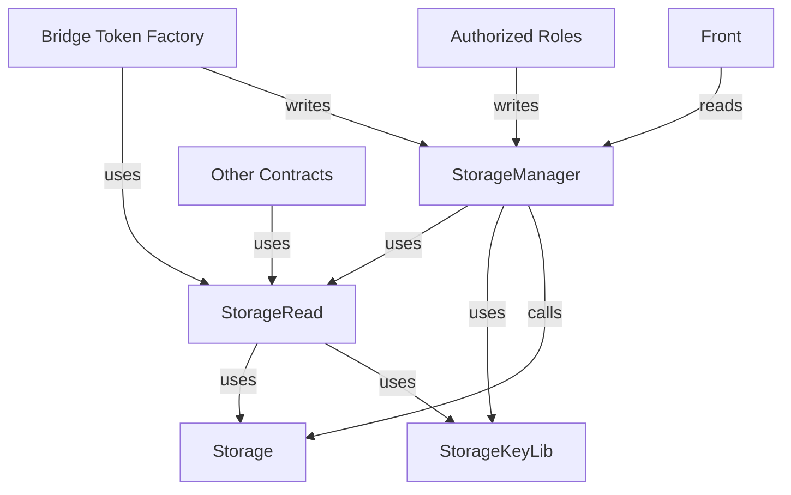
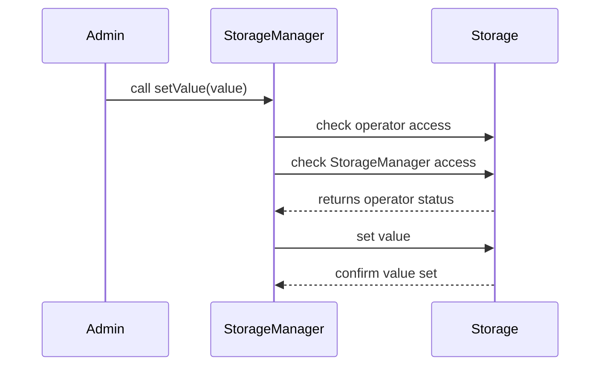

# Redesign of Storage for Scalability and Robustness

## Introduction

Our current system employs several storage solutions, including eternal storage. Specific data related to a particular theme is tied to its contracts: balances are managed in the vault (as they describe its funds), while user operation details reside in the relayer and bridge contracts, as they depend on the logic of this version of the contracts and are independent of other data. The Storage contract, on the other hand, consolidates all data that, like the vault balances, should not be changed (the vault and storage are not intended to be redeployed in other versions). Therefore, the storage includes everything related to references, bridge configuration, and permissions.

In the interest of adhering to the eternal storage pattern, we propose to improve it.

## Proposed Improvements

### Separation of Concerns

In order to improve the readability and the maintenance of this part. We suggest that the Storage contract only contains the getters and setters for the storage mappings, while externalizing the appropriate getters and setters for the bridge's use.

- **Getters**: We will place these in a library that will be used as an intermediary by other contracts.
- **Setters**: We will create a dedicated setter contract.
- **Access Rights**: The Setter contract (and the sudo admin) will be the only one authorized to modify the storage. This contract will be in charge of managing the access rights to its functions.

### Improvements to Getters

To enhance the efficiency of our getters, we recognize that there are instances when multiple values from storage are required in a single function. As such, we will create generic data getters within the storage that allow for requesting a specified number of values of potentially different types.

While we acknowledge that using loops or arrays is not optimal, this approach will significantly reduce the number of external calls made within a function to obtain necessary values. For example, if five data points are needed, we estimate a gas savings of approximately **15000 gas**.

At first this multi-getter will return an array of struct `Data` containing the different types of data.
In a second step, we will implement a `multiGetter` function that will return an array of bytes, and the caller will have to cast the data to the correct type. A set of cast functions will be provided in a library. The possibility of returning data in the form of a long 'bytes' is considered, it will also be necessary in this case to cast the output.

### Flexibility and Robustness

This design allows for greater flexibility and robustness over time, accommodating any necessary modifications in the future. This also ensures that we can add, modify getters and setters if necessary in the case of new versions of 'Relayer' and 'Bridge' contracts

## Splitting the Storage Contract

### Overview

Currently, the storage contract is designed as a monolithic eternal storage solution. To enhance modularity, maintainability, and security, we will split the contract into four distinct components:

**Storage**: This component will serve as a pure eternal storage contract, containing mappings organized by data types along with their respective setter and getter functions. The setters will be duplicated (init and update) to handle potential key collisions effectively.

**StorageKeyLib**: This is a helper library designed to create composite keys for the mappings. It will be utilized by all contracts that interface with the storage. The functions within this library will be internal, meaning the bytecode of these functions will be integrated into the deploying contracts.

**StorageRead**: This library will provide getter functions tailored for use by other contracts. Similar to StorageKeyLib, it will consist solely of internal functions, ensuring that the bytecode is deployed alongside the user contracts.

**StorageManager**: This contract will serve as the setter interface, utilizing the StorageRead library. Only admins or authorized roles will be able to make changes. Access control will be enforced at the function level within the StorageManager. The Storage contract itself will check access only through this manager or the 'sudo admin'. No other contracts will be permitted to call the Storage directly, except for the bridge token factory, which will set new tokens in the storage. The front or external actors will leverage StorageRead to access the getters via StorageManager, thereby avoiding the need for external calls in the library and preventing the need of deploying a standalone contract.

### Graph Diagram

Here’s a graph diagram to visualize the new architecture of the storage system:

**Explanation of Components**
**Storage**: The core eternal storage that holds the data. It ensures that any modifications are made through controlled setters, preventing unauthorized access.

**StorageKeyLib**: This library is crucial for generating composite keys, ensuring that the keys used across different contracts are consistent and collision-free.

**StorageRead**: Provides a streamlined way for other contracts to retrieve data without.

**StorageManager**: Acts as the gatekeeper for data modification, ensuring that only authorized entities can change the stored information.

## Access Control Mechanisms

### Overview

In the refactored storage architecture, access control is crucial to ensure secure interactions with the Storage contract. This section covers two main aspects: access to functions and mappings in the Storage contract, and the operator registry that maintains authorized addresses.

### Access Control Phases

**Function Access Control:**
In this refactoring, the StorageManager will handle all setter operations. When an admin wants to create or update a value, they will call the StorageManager.
The StorageManager will first check if the caller is authorized by verifying against the operator registry stored in the Storage.
After authorization, the StorageManager will call the Storage contract to set the value. The Storage contract will verify that the caller is either the StorageManager or the sudo admin before proceeding to set the value.

**Operator Registry:**
We will maintain a mapping (mapping(bytes32 => address)) where the key represents the operator. The StorageManager will retrieve the address for the operator from the Storage. (As the initial implementation).
To enhance security, we will integrate a Role-Based Access Control (RBAC) mechanism. The mappings and role data will reside in the Storage, retaining the operator registry concept to ensure efficient access checks without the overhead of frequent RBAC checks (use of 'contains' function).

**Using a Multi-Getter:**
A multi-getter function in the Storage will allow retrieval of multiple values and access data in a single call. This optimizes the process and reduces gas costs when multiple values are needed.
Getting authorization data wil not increase the number of external calls. It implies that the authorization checks will be done in the functions at their beginning not via modifiers and just after retrieving the data from the storage.

### Access Flow

**Setter Example: When an admin creates a value:**
The admin calls the StorageManager.
The StorageManager checks access by querying the Storage to verify the operator.
Upon successful authorization, the StorageManager calls the Storage to set the value.
The Storage contract checks whether the caller is the StorageManager or the sudo admin before setting the value.

### Reflexion on Access Control

The RBAC mechanism following openzeppelin pattern will need adaptations to fit our needs.
Concerning the update of somme contract a two step process will be implemented to ensure that the caller is the right one (set the operator and then accept the update). This will need also adaptations to be used with this RBAC mechanism.

## Conclusion

By implementing these changes, we aim to create a more scalable and robust storage solution that adheres to the eternal storage pattern while improving gas efficiency and maintaining security.
