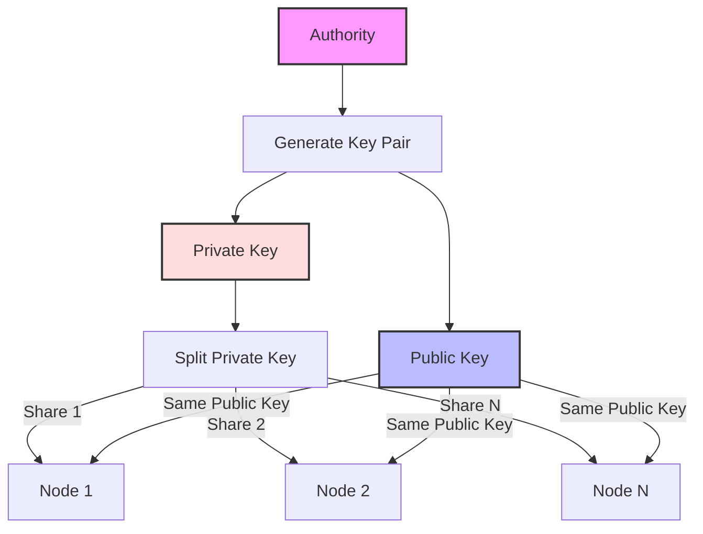
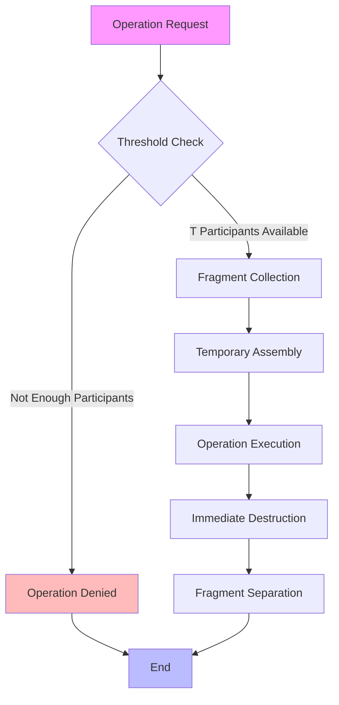
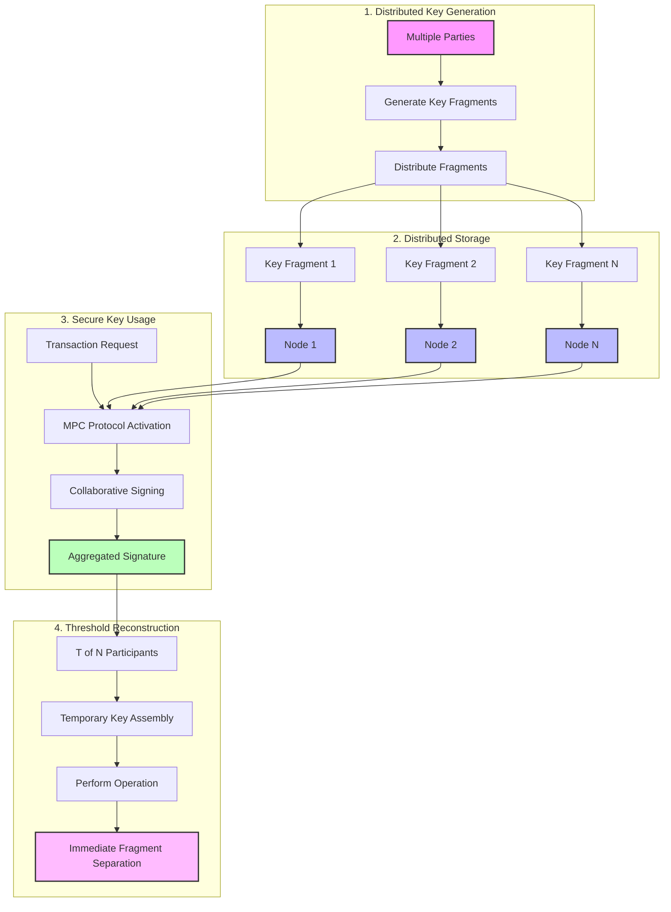

# Shared Key Management <!-- omit in toc -->

[back](../README.md)

## Overview <!-- omit in toc -->

Shared Key Management through Multi-Party Computation (MPC) is a cryptographic approach that enables multiple parties to collaboratively manage and use cryptographic keys without any single entity having access to the complete key. This system enhances security and trust in critical cryptographic operations.

## Table of Contents <!-- omit in toc -->

- [Collaborate between multiple parties](#collaborate-between-multiple-parties)
- [Purpose of Shared Key Management](#purpose-of-shared-key-management)
- [Operating Principle](#operating-principle)
  - [Key Steps: 1. Key Generation](#key-steps-1-key-generation)
  - [Key Steps: 2. Share Distribution](#key-steps-2-share-distribution)
  - [Key Steps: 3. Secure Use of the Key](#key-steps-3-secure-use-of-the-key)
  - [Key Steps: 4. Temporary Reconstruction with Threshold](#key-steps-4-temporary-reconstruction-with-threshold)
  - [Global Diagram](#global-diagram)
- [Benefits](#benefits)
  - [Increased Security](#increased-security)
  - [Fault Tolerance](#fault-tolerance)
  - [Elimination of Single Point of Failure](#elimination-of-single-point-of-failure)
  - [Simplicity of Audit and Compliance](#simplicity-of-audit-and-compliance)

## Collaborate between multiple parties

- Generate, store, and use cryptographic keys securely without any single entity having access to the full key
- Helps improve security by distributing trust and preventing anyone from controlling the private key in isolation

## Purpose of Shared Key Management

- The goal is to share responsibility for a cryptographic key (usually a private key) between multiple parties while ensuring that this key will never be fully reconstructed by a single entity.
- This is particularly useful in applications where the security of the key is critical, such as in:
  - transaction signing
  - authentication
  - certificate management.

## Operating Principle

- In shared key management with MPC, the private key is never stored in its entirety in a single location.
- Instead, the key is divided into fragments (or "shares") and each participant in the network receives a portion of the key.
- An MPC protocol is used to allow participants to sign transactions or perform cryptographic operations without ever reconstituting the entire key.

### Key Steps: 1. Key Generation

- Generate an individual secret for each party
- The public key will be used for signature verification
- Each party receives a fragment of the key.
- No party ever has access to the full key, even during the generation phase.

### Key Steps: 2. Share Distribution

- Each fragment of the key is held by a different participant.
- Storage can be done on different nodes or systems, which increases security by reducing the risks associated with a single compromise.

### Key Steps: 3. Secure Use of the Key

- When it is necessary to perform an action that requires the use of the private key (for example, signing a transaction or decrypting a message), an MPC protocol allows participants to collaborate to collectively sign the transaction or perform the cryptographic operation, without ever reconstructing the entire key.
- The protocol computes the final signature in a distributed manner by aggregating the fragments.

### Key Steps: 4. Temporary Reconstruction with Threshold

- In some systems, it may be necessary to temporarily reconstruct the key for some operations. This is usually done by setting a threshold (e.g., a T-of-N configuration), where at least T participants (out of a total of N) must collaborate to reassemble the key.
- Once the operation is completed (e.g., signing or decryption), the entire key is no longer used, and the fragments remain separate.

### Global Diagram

## Benefits

### Increased Security

- No participant ever holds the full key, preventing any malicious individual or organization from compromising the private key.
- Even if a fragment is compromised, this does not allow the attacker to reconstruct the full key unless they have access to a sufficient number of fragments.

### Fault Tolerance

- By using T-of-N (threshold participation) schemes, the system can operate even if some participants are unavailable or have experienced failures.
- This allows for some resilience to failures in the network.

### Elimination of Single Point of Failure

Since the private key is never centralized in a single location or held by a single entity, there is no single point of failure. This protects against single-point-of-entry attacks (such as hacking a central server).

### Simplicity of Audit and Compliance

Using MPC for key management makes the system more transparent and auditable, facilitating regulatory compliance in environments where key security is critical (e.g., financial services).
