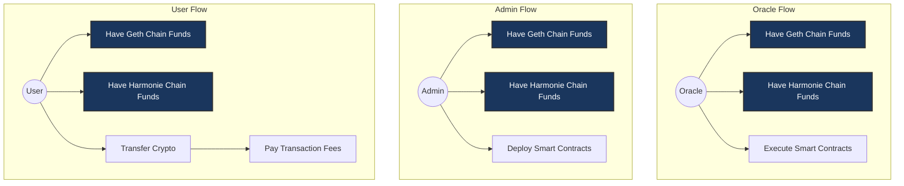

# Bridge v1 - Centralized POC

## About this Guide

This guide explains how to set up and run a bridge between Ethereum (Geth) and Harmonie blockchains.

## Prerequisites

### Required Accounts

Add these testing accounts to your wallet by importing their private keys:

| Account | Public Key | Private Key | Role |
|---------|------------|-------------|----- |
| admin | 0xf39fd6e51aad88f6f4ce6ab8827279cfffb92266 | ac0974bec39a17e36ba4a6b4d238ff944bacb478cbed5efcae784d7bf4f2ff80 | Deploy contracts |
| user | 0x70997970c51812dc3a010c7d01b50e0d17dc79c8 | 59c6995e998f97a5a0044966f0945389dc9e86dae88c7a8412f4603b6b78690d | Transfer crypto |
| oracle | 0x3C44CdDdB6a900fa2b585dd299e03d12FA4293BC | 0x5de4111afa1a4b94908f83103eb1f1706367c2e68ca870fc3fb9a804cdab365a | Execute contracts |

**Important**: These accounts are for testing purposes only. Never use them in production. They are available with [Anvil](https://github.com/foundry-rs/foundry/tree/master/crates/anvil)

## System Architecture



## Setting Up Ethereum with Geth

### 1. Installing Geth

1. Visit [geth.ethereum.org](https://geth.ethereum.org/docs/getting-started/installing-geth) for installation instructions
2. Download Geth and development tools (including `clef`) from [downloads page](https://geth.ethereum.org/downloads)

### 2. Running Geth in Development Mode

```sh
geth --datadir /root/.ethereum --dev.period 12 --http --http.corsdomain '*' --http.api web3,eth,debug,personal,net --vmdebug --dev
```

*Note: `/root/.ethereum` is the default data directory. You can specify a different location.*

### 3. Account Setup on Geth

#### A. Import Private Keys

```sh
# Import admin account (0xf39Fd6e51aad88F6F4ce6aB8827279cffFb92266)
echo "ac0974bec39a17e36ba4a6b4d238ff944bacb478cbed5efcae784d7bf4f2ff80" > admin
clef --keystore /root/.ethereum/keystore importraw admin

# Import oracle account (0x3C44CdDdB6a900fa2b585dd299e03d12FA4293BC)
echo "5de4111afa1a4b94908f83103eb1f1706367c2e68ca870fc3fb9a804cdab365a" > oracle
clef --keystore /root/.ethereum/keystore importraw oracle

# Import user account (0x70997970C51812dc3A010C7d01b50e0d17dc79C8)
echo "59c6995e998f97a5a0044966f0945389dc9e86dae88c7a8412f4603b6b78690d" > user
clef --keystore /root/.ethereum/keystore importraw user
```

*Note: The password must be at least 10 characters long.*

#### B. Fund the Accounts

```sh
geth attach /root/.ethereum/geth.ipc

# Fund admin with 50 ETH
eth.sendTransaction({
    from: eth.accounts[0],
    to: "0xf39Fd6e51aad88F6F4ce6aB8827279cffFb92266",
    value: web3.toWei(50, "ether")
})

eth.sendTransaction({
    from: eth.accounts[0],
    to: "0x3C44CdDdB6a900fa2b585dd299e03d12FA4293BC",
    value: web3.toWei(50, "ether")
})

# Fund user with 50 ETH
eth.sendTransaction({
    from: eth.accounts[0],
    to: "0x70997970C51812dc3A010C7d01b50e0d17dc79C8",
    value: web3.toWei(50, "ether")
})
```

#### C. Verify Account Setup

```sh
# List accounts
eth.accounts

# output
[
    "0xc3a15f29faa536cb90edfcaabdc1402f04412b72",
    "0xf39fd6e51aad88f6f4ce6ab8827279cfffb92266",
    "0x3c44cdddb6a900fa2b585dd299e03d12fa4293bc",
    "0x70997970c51812dc3a010c7d01b50e0d17dc79c8"
]

# Where index is:
# 0 - 0xc3a15f29faa536cb90edfcaabdc1402f04412b72 (default Geth account)
# 1 - 0xf39fd6e51aad88f6f4ce6ab8827279cfffb92266 (admin)
# 2 - 0x3c44cdddb6a900fa2b585dd299e03d12fa4293bc (oracle)
# 3 - 0x70997970c51812dc3a010c7d01b50e0d17dc79c8 (user)

# Check balances (in ETH)
eth.getBalance(eth.accounts[1])/1e18  # admin
50
eth.getBalance(eth.accounts[2])/1e18  # oracle
50
eth.getBalance(eth.accounts[3])/1e18  # user
50
```

*Note: Wait for block finality to see updated balances.*

## Setting Up Harmonie

### 1. Harmonie Node Setup

1. Follow the installation guide at [Harmonie installation](https://docs.allfeat.com/running-a-node/without-docker/)

Important! Allfeat removed `Frontier` which enables EVM compatibility. To follow this procedure reset to this commit `c9a41be51bb4ebb0e925e40657d07733fc57a9d3`

```sh
git clone https://github.com/Allfeat/Allfeat.git

cd Allfeat

git branch bridge-c9a41be c9a41be

git switch bridge-c9a41be

cargo build --release
```

### 2. Start Harmonie Development Node

Replace `<path>` with a folder name

```sh
./target/release/allfeat --dev --base-path <path>

# Example:
./target/release/allfeat --dev --base-path /tmp/.harmonie
```

### 3. Fund Accounts on Harmonie

1. Connect to [Polkadot Apps](https://polkadot.js.org/apps)
2. Select "DEVELOPMENT" network (top right)
3. Choose "Local Node"
4. Click "Switch"
5. Navigate to "Accounts"
6. Locate "ALITH" account under "Development"
7. Send 50 tokens to admin account:
   - Click "Send"
   - Select `admin` address
   - Set amount to 50
   - Click "Make Transfer"
   - Click "Sign and Submit"
8. Repeat for `oracle` and `user` account

## Add blockchain/network to your wallet

| Network | rpc | chain id | Token symbol |
|---------|------------|-------------|----- |
| geth | http://127.0.0.1:8545 | 1337 | ETH |
| harmonie | http://127.0.0.1:9944 |440 | AFT |

## Setting Up RabbitMQ

### 1. Install RabbitMQ

```bash
docker run -it --rm --name rabbitmq -p 5672:5672 -p 15672:15672 rabbitmq:3.13-management
```

### 2. Queue Configuration

1. Access RabbitMQ dashboard at [http://localhost:15672/#/queues](http://localhost:15672/#/queues)
2. Create new queue named "bridge.relayer.dev"

## Deploying Bridge Smart Contracts

### 1. Clone and Setup Bridge Repository

```sh
git clone https://github.com/chaincraft-labs/bridge.git
cd bridge/hardhat
```

### 2. Configure and Deploy

1. Set active configuration in config file:

```yaml
{
    "activeConfig": "localNode",
    ...
}
```

2. Deploy contracts

```sh
./scripts/09_deployAndConfig.sh
```

## Setting Up Relayer Nodes

### 1. Relayer Installation

```sh
# Clone repository
git clone https://github.com/chaincraft-labs/bridge-relayer.git
cd bridge-relayer/relayer-py

# Set up Python environment
python -m venv .venv
source .venv/bin/activate
python -m pip install --upgrade pip
pip install poetry==1.8.3
poetry install
```

### 2. Configure Relayer

Create `.env.config.dev`, add the `oracle`'s private key and add the `RelayerBase`'s contract addresses

```sh
# Contract Addresses
SMART_CONTRACT_ADDRESS_440=  # Harmonie Relayer address
SMART_CONTRACT_ADDRESS_1337= # Geth Relayer address

# Oracle private key
PK_440=5de4111afa1a4b94908f83103eb1f1706367c2e68ca870fc3fb9a804cdab365a
PK_1337=5de4111afa1a4b94908f83103eb1f1706367c2e68ca870fc3fb9a804cdab365a
```

### 3. Start Relayer Services

```bash
# Start Harmonie listener
cd relayer-py
poetry run python bin/event_listener.py --chain_id 440

# Start Geth listener (new terminal)
poetry run python bin/event_listener.py --chain_id 1337

# Start task listener (new terminal)
poetry run python bin/task_listener.py --watch
```

## Setting Up Bridge Frontend (dApp)

### 1. Install Frontend

```sh
git clone https://github.com/chaincraft-labs/bridge-ui.git
cd bridge-ui
pnpm install
```

### 2. Configure Environment

Create `.env.development`:

```sh
# Harmonie Contracts
NEXT_PUBLIC_HARMONIE_STORAGE_ADDRESS=""
NEXT_PUBLIC_HARMONIE_BRIDGE_ADDRESS=""
NEXT_PUBLIC_HARMONIE_RELAYER_ADDRESS=""
NEXT_PUBLIC_HARMONIE_VAULT_ADDRESS=""
NEXT_PUBLIC_HARMONIE_HBETH_ADDRESS=""

# Geth Contracts
NEXT_PUBLIC_ETHEREUM_STORAGE_ADDRESS=""
NEXT_PUBLIC_ETHEREUM_BRIDGE_ADDRESS=""
NEXT_PUBLIC_ETHEREUM_RELAYER_ADDRESS=""
NEXT_PUBLIC_ETHEREUM_VAULT_ADDRESS=""
NEXT_PUBLIC_ETHEREUM_GBHMY_ADDRESS=""
```

### 3. Start Frontend

```sh
npm run dev
```
